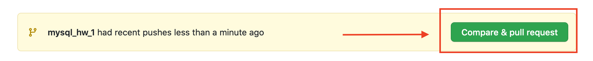
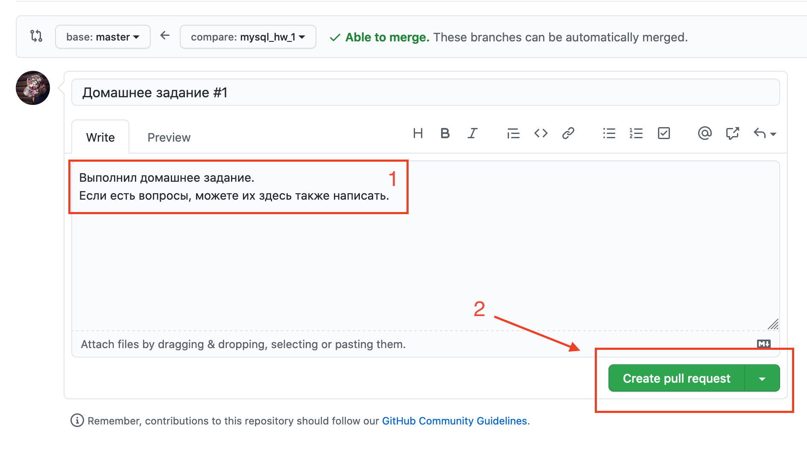

# Руководство по ведению репозитория


- Поддерживайте всегда актуальность вашего репозитория, вовремя выполняйте домашние задания, и сдедите за тем, чтобы локально у вас тоже была актуальная версия проекта. 
- Никогда не коммитьте ничего самостоятельно в ветку `main`. Это может делать только преподаватель. Если вы попытаетесь это сделать, то это помешает нормальному обновлению репозитория, могут возникнуть конфликты.
- Задание считается выполненным, если преподаватель принял пулл реквест и исходные файлы попали в  `main` ветку проекта.


 ## Инструкция по выполнению домашнего задания

1. Прежде чем начать выполнять домашнее задание, вы должны создать ветку для него. Название ветки должны быть в формате `module_name-hw_number`. Создание новой ветки происходит из ветки `main`. Чтобы перейти в ветку `main`  выполните команду в терминал

   ```bash
   git checkout main
   ```

   Создание ветки для домашнего задания

   ```bash
   git checkout -b mysql_hw_1
   ```

2. Итак, когда вы попали в ветку с домашним заданием, подготовте структуру директорий: если домашнее задание к примеру по базе данных, то все исходные файлы должны располагаться в директории `src/mysql/`. Для выполнения конкретного задания создайте папку `src/mysql/hw_1`. И вот только здесь вы создаете исходные файлы например для выполнения домашнего задания к первой лекции. Также в папке с выполненным заданием вы должны создать файл `Readme.md` , в который скопируете задание. Таким образом в папке будет лежать то, что заданное и то, как вы это выполнили.

3. После того, как вы выполнили домашнее задание, необходимо добавить файлы в индекс командой

   ```bash
   git add .
   ```

4. Файлы добавленные в индекс необходимо зафиксировать, выполнить коммит

   ```bash
   git commit -m "Домашнее задание по лекции #1"
   ```

5. Чтобы отправить все зафиксированные изменения в удаленный репозиторий, вам необходимо запушить в одноименную ветку удаленного репозиторий, например

   ```bash
   git push origin mysql_hw_1
   ```

6. Далее переходите на сайт github.com в свою учетку непосредственно в репозиторий с домашними заданиями и если у вас домашнее задание <u>полностью готово и вы не будете больше вносить никаких правок</u>, то вы делаете пулл реквест в `main`  ветку.

   <p align="center"></p>

   

7. Далее вы можете написать комментарий к пулл реквкесту и подтвердить его отправку

   <p align="center"></p>

8. Вот и все! Хотя нет, осталось последнее: скопируйте из адресной строки браузера ссылку на пулл реквест и отправте ее вашему преподавателю личным сообщением в телеграме.


#### Здесь можете посмотреть часто задаваемые вопросы

 [Коллекцию часто задаваемых вопросов по Git](http://firstaidgit.ru).

