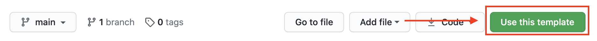
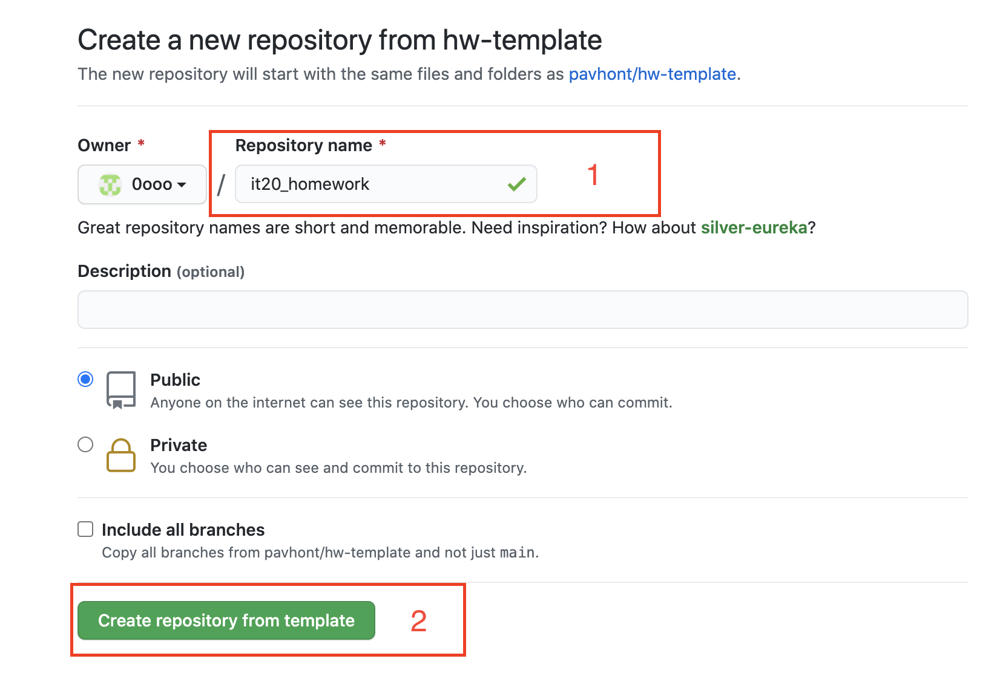
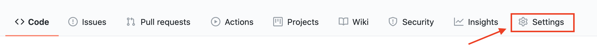
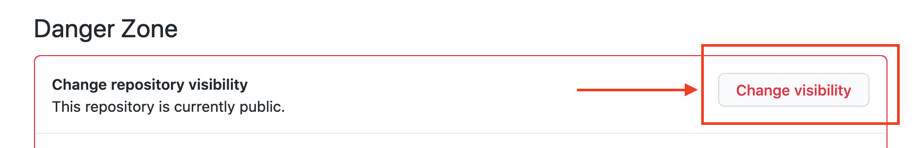
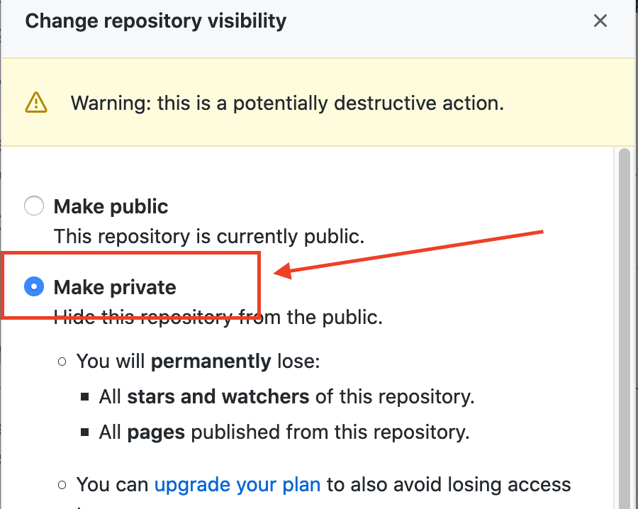
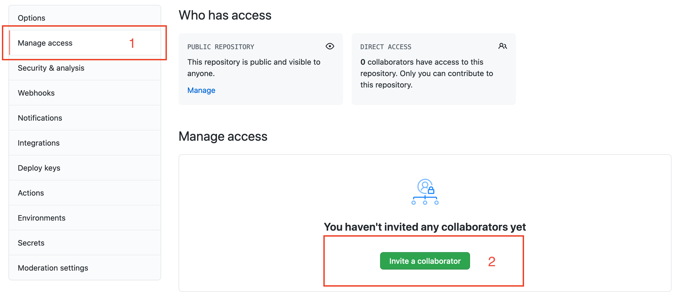
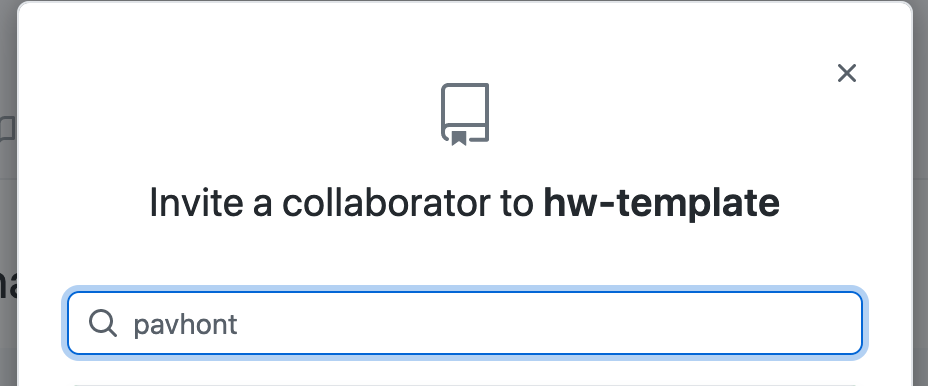
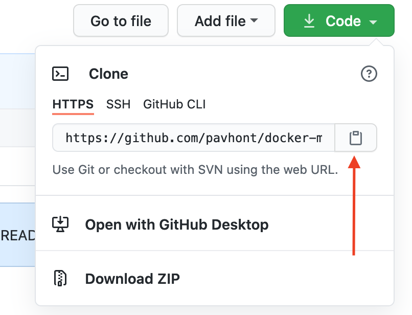

# Личный проект

- Студент: Имя Фамилия
- Группы: 0
- Форма обучения: ?удаленно


------


> **Важно!** 
>
> 1. Ваши исходные файлы должны располагаться в папке `src/`.
>
> 2. Не удаляйте файлы: `Readme.md`, `Contributing.md`, `.gitignore`.
> 3. Не удаляйте папки: `images/`, `src/`.


[Contributing.md](./Contributing.md) -  Руководство по ведению репозитория


### Как начать?


#### 1. Создать учетку на Github

Если у вас ещё нет аккаунта на [github.com](https://github.com/join), его необходимо создать и установить git на ваш компьютер.


#### 2. Шаблон

[Откройте шаблон домашних заданий](https://github.com/pavhont/hw-template) и нажмите зеленую кнопку `Use this template` . 

<p align="center"></p>

В открывшемся окне необходимо указать имя будущего репозитория и нажать зеленую кнопку `Create repository from template`

<p align="center"></p>

Репозиторий будет скопирован в ваш аккаунт.


Далее необходимо перейти в настройки `Settings`. 

<p align="center"></p>


Пролистать в самый низ и сделать репозиторий приватным.

<p align="center"></p>


Чтобы применить выбранные настройки необходимо будет ввести название репозитория, как показано в примере

<p align="center"></p>


#### 3. Совместная работа 

Чтобы преподаватель смог проверять ваши домашние задания, необходимо, чтобы вы открыли ему доступ к этому приватному репозиторию. Для того, чтобы это сделать необходимо снова перейти в настройки `Settings`, в левом боковом меню, выбрать раздел `Manage access` , в открывшемся разделе при помощи зеленой кнопки `Invite a collaborator` пригласить преподавателя.  

<p align="center"></p>


В открывшемся модальном окне введите имя учетки преподавателя `pavhont`. 

<p align="center"></p>


#### 4. Клонируйте репозиторий на свой компьютер

Далее вы должны клонировать ваш репозиторий к себе на компьютер, обратите внимание: нужно клонировать свой репозиторий, а не репозиторий-шаблон домашнего задания из учетки преподавателя. Ссылку для клонирования можете получить как показано на скрине.

<p align="center"></p>

Выполните локально команду для клонирования репозитория 

```bash
git clone ссылка_на_ваш_репозиторий
```


#### 5. Приступайте к выполнению домашних заданий.